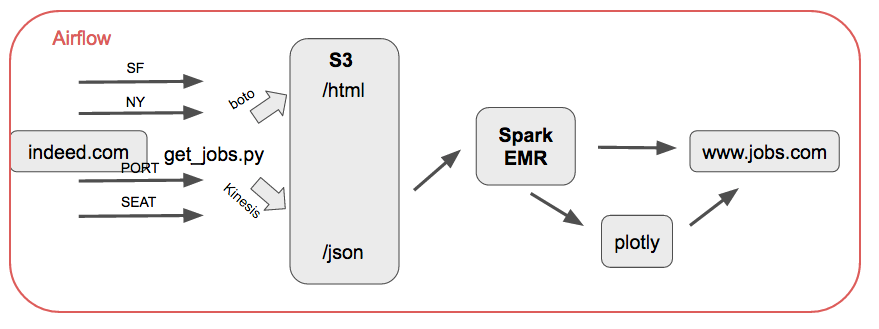
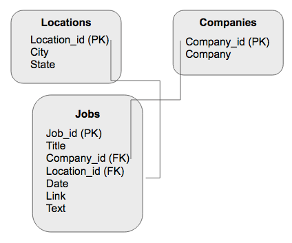

Pipeline to Pull Fresh Data Science Jobs
----
ETL pipeline using Spark, Airflow, & EMR to crawl jobs from [Indeed.com](https://www.indeed.com/) and mine them for daily new postings and present them on a [website](http://www.jobs.com.s3-website-us-east-1.amazonaws.com/). Airflow monitoring can be found [here](http://ec2-54-82-204-189.compute-1.amazonaws.com:8080/admin/).

** info **  

    Dasha Zmachynskaya    : dasharya@gmail.com
    3/9/17

----

Table of Contents
----
- Objective
- Installation & Setup
- Discussion
- Appendix

----
Installation & Setup
----

I used a t2.micro with Ubuntu in EC2 for my project. After setting up the machine, run the env_setup.sh to install dependencies & setup Airflow. Add these files to the instance:

- get_jobs.py
- step.json
- bootstrap.json
- webpage_maker.py
- jobs_pipeline.py

The setup in S3 is broken down into two buckets - /html contains a boto dump of raw html files for daily job postings & /json contains the kensis firehose data from the same job postings once they've been cleaned up into json format.

These files should be up in S3 so EMR can reference them:
- package_dependencies.sh
- job_ranker_v4.py
- a yaml file containing my plotly credentials

Now you can simply ssh into the ec2 machine and run webpage_maker.py once to create the state pages that don't change. Then, you can run jobs_pipeline.py in Airflow to have the process rerun.

----
Discussion
----

Given more time, I would collect the final url (not the reroute url from indeed) since does expire. Next, I would continue to iterate on the Score of job postings. Currently it's a weighted average cosine similarity of the tf-idf vectors from unstructured text of job postings. These postings have a lot of junk irrelevant to the position. I imagine cleaning this text better would have significant gains in the quality of the score. Last, as the size of my dataset grows, I would expect something like Latent Sensitivity Hashing to be a more practical solution for accomplishing this task.

---
Appendix - Properties
---

1. Robustness & fault tolerance
  i. *how does my system have this property:*
  My data storage is more resillient because I don't just store the json files of cleaned crawled data but the original html as well in the chance that my firehose breaks.

  ii. *how does my system fall short:*
  Currently I have only one server where I house the batch processes that scrape the web. If one goes down, my system is vulnerable. Ideally I would have backup servers.

2. Low latency and updates
  i. *how does my system have this property:*
  My system will update daily, which is the same cadence with which job postings are updated- since that's actually the most granular refresh that can be acquired from Indeed.com

  ii. *how does my system fall short:*
  If I did happen to have more jobs coming in at a higher than daily rate, my system would have trouble keeping up with the cadence, since I'm designing it around a 1 day cadence to refresh the transformations and databases.

3. Scalability
  i. *how does my system have this property:*
  The crawler code is modularized to be able to run on multiple machines if necessary as it pulls down various job queries. In addition, I run the transformation in Spark EMR, which should scale well with the data

  ii. *how does my system fall short:*
  If it gets truly large enough, the data will outgrow my clusters. I will need to increase the size of my clusters.

4. Generalization
  i. *how does my system have this property:*
  It's very easy for me to switch the applications I use to run my code. For instance, if I need more RAM, scaling up clusters is easy.

  ii. *how does my system fall short:*
  I have many scripts for setup that depend on Ubuntu.

5. Extensibility
  i. *how does my system have this property:*
  Currently, I'm only pulling in data science jobs for a few positions in very specific areas; however, these queries are simple inputs to functions in my code, so getting more data on other regions for other positions is extremely trivial

  ii. *how does my system fall short:*
  If I were to want to include jobs postings outside of Indeed, this would be a very challenging task -- I would essentially have to build a new crawler to account for the structure of a completely different website.

6. Ad hoc queries
  i. *how does my system have this property:*
  My data only presents a view of the data from the past 14 days. It's essentially the output of a single query.

  ii. how does my system fall short:
  I plan to incorporate ad-hoc querying in the future with Cassandra

7. Minimal maintenance
  i. *how does my system have this property:*
  Airflow makes life a lot easier here, with email notifications set up to go out if something breaks in my processes, so I don't have to monitor changes.

  ii. *how does my system fall short:*
  It will be difficult to have feedback if something on the way Indeed presents its jobs postings changes dramatically. In fact, it's likely to break the entire system, and I would have to rewrite the crawler.

8. Debuggability
  i. *how does my system have this property:*
  Because I'm saving the original html files in S3, if something goes wrong, it is very straight-forward which key to reference in S3 to see what broke the code. In addition, my EMR batch script outputs logging to S3.

  ii. *how does my system fall short:*
  Currently, my try-except statement that iterates over my jobs postings just continues through the loop, without informing me on the errors or reasons why. I would set up my own logging code, since even though I have logging setup for S3, it's not easily comprehensible.

  ---
  Appendix - 3NF
  ---
I did not have to normalize my data, since the output that I present in my final output on the website is essentially a cleaned version of the original json, after reordering the output. Thus 3NF from would be contrived for my case. If I did choose to normalize my data, this is what it would look like however:

